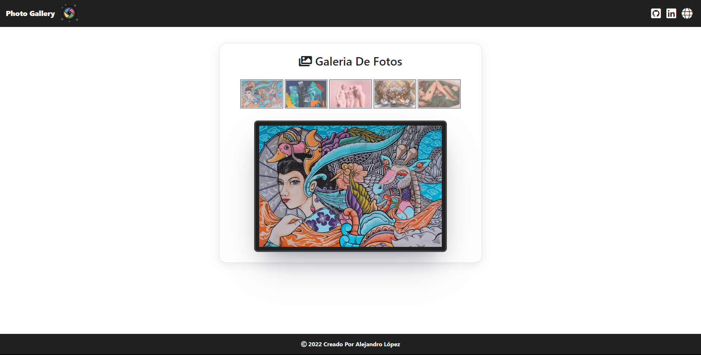

# <h1 align="center" style="color: #80cbc4;"> Photo Gallery 📷 </h1> 
  

The `Photo Gallery` is the place where a set of photographs is exhibited, that is, an art gallery specialized in photography, and on the other hand, the set of photographic works exhibited in said place.
         
  

## 
 Requirements 

- [HTML5](https://developer.mozilla.org/es/docs/Web/HTML) 
- [CSS3](https://developer.mozilla.org/es/docs/Web/CSS)

  

## 
 Screenshot Project 💻 

🔶 [Project Website](https://alejandro-lopez.futuretecware.com/Photo-Gallery/)

